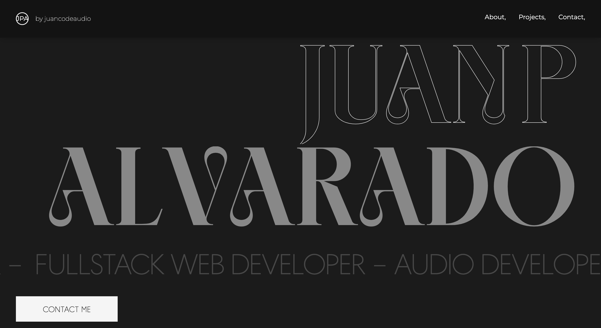

<!-- PROJECT LOGO -->
<br />
<div align="center">
  <h1 align="center">Juan Pablo's Portfolio Website</h1>

  <p align="center">
    This repository contains the code for my personal portfolio website.
    <br />
    <br />
    <a href="https://juancodeaudio.com">View Demo</a>
    ·
    <a href="https://github.com/juancodeaudio/juancodeaudio-portfolio/issues">Report Bug</a>
  </p>
  
</div>

<!-- TABLE OF CONTENTS -->
<br />
<details>
  <summary>Table of Contents</summary>
  <ol>
    <li><a href="#overview">Overview</a></li>
    <li><a href="#features">Features</a></li>
    <li><a href="#technologies-used">Technologies Used</a></li>
    <li><a href="#how-to-run-locally">How to Run Locally</a></li>
    <li><a href="#contact">Contact</a></li>
    <li><a href="#license">License</a></li>
  </ol>
</details>
<br />

## Overview

This portfolio website showcases my work as a Web and Audio Developer. It includes my projects, skills, and ways to contact me.

<br />

## Features

- About Me: A brief introduction about myself.
- Projects: A showcase of my projects with links to live demos and source code.
- Skills: A list of my technical skills.
- Contact Me: A page where visitors can send me a message.

<br />

## Technologies Used

  [![Tailwind][Tailwind]][Tailwind-url]
  [![Typescript][Typescript]][Typescript-url]
  [![Next][Next.js]][Next-url]
  [![FramerMotion][FramerMotion]][FramerMotion-url]
  [![Resend][Resend]][Resend-url]

<br />

## How to Run Locally

1. Clone the repository:
    ```sh
    git clone https://github.com/juancodeaudio/juancodeaudio-portfolio.git
    ```
2. Navigate into the directory:
    ```sh
    cd juancodeaudio-portfolio
    ```
3. Install NPM packages
   ```sh
   npm install
   ```
4. Create a `.env.local` file and enter your Resend API key
   ```js
   RESEND_API_KEY='ENTER YOUR API'
   ```
5. Run the development server
    ```sh
    npm run dev
    ```

<br />

## Contact

If you have any questions, feel free to contact me at [hello@juancodeaudio.com](mailto:hello@juancodeaudio.com).

<br />

## License

This project is under the MIT license.


[Tailwind]: https://img.shields.io/badge/Tailwind-37BCF8?style=for-the-badge&logo=tailwindcss&logoColor=white
[Tailwind-url]: https://tailwindcss.com/
[Typescript]: https://img.shields.io/badge/Typescript-3077C6?style=for-the-badge&logo=typescript&logoColor=white
[Typescript-url]: https://www.typescriptlang.org/
[Next.js]: https://img.shields.io/badge/next.js-000000?style=for-the-badge&logo=nextdotjs&logoColor=white
[Next-url]: https://nextjs.org/
[FramerMotion]: https://img.shields.io/badge/Framer_Motion-EC3BB5?style=for-the-badge&logo=framer&logoColor=white
[FramerMotion-url]: https://www.framer.com/motion/
[Resend]: https://img.shields.io/badge/Resend-000000?style=for-the-badge
[Resend-url]: https://resend.com/overview